# HH Goa Face Identification and Blockchain Verification

## Architecture, Implementation, Execution, Testing, and Submission Blueprint

> **Document purpose:** This is a build-ready technical plan. It describes what to build, how components interact, how to execute and test the pipeline, how to demonstrate it, and what limitations must be disclosed. It does not claim that any software described here has already been implemented.

---

## Table of Contents

1. [Executive Summary](#1-executive-summary)
2. [Scope and Verification Claims](#2-scope-and-verification-claims)
3. [Challenge Requirement Mapping](#3-challenge-requirement-mapping)
4. [Recommended Technology Stack](#4-recommended-technology-stack)
5. [System Architecture](#5-system-architecture)
6. [Trust Boundaries and Threat Model](#6-trust-boundaries-and-threat-model)
7. [End-to-End Pipeline](#7-end-to-end-pipeline)
8. [Component Design](#8-component-design)
9. [Face Detection and Matching Policy](#9-face-detection-and-matching-policy)
10. [Live Web and Social-Media Discovery](#10-live-web-and-social-media-discovery)
11. [Secure Candidate Retrieval](#11-secure-candidate-retrieval)
12. [Evidence Bundle and Manifest](#12-evidence-bundle-and-manifest)
13. [Deterministic Canonicalization and Hashing](#13-deterministic-canonicalization-and-hashing)
14. [Blockchain Contract Architecture](#14-blockchain-contract-architecture)
15. [Verification Semantics](#15-verification-semantics)
16. [Proposed Repository Structure](#16-proposed-repository-structure)
17. [Dependencies and Configuration](#17-dependencies-and-configuration)
18. [Implementation Milestones](#18-implementation-milestones)
19. [Target Execution Runbook](#19-target-execution-runbook)
20. [Testing Strategy](#20-testing-strategy)
21. [Demo Subject and Image Selection](#21-demo-subject-and-image-selection)
22. [Screen-Recording Runbook](#22-screen-recording-runbook)
23. [README Requirements](#23-readme-requirements)
24. [Privacy, Security, Accuracy, and Legal Considerations](#24-privacy-security-accuracy-and-legal-considerations)
25. [Troubleshooting](#25-troubleshooting)
26. [Acceptance Criteria](#26-acceptance-criteria)
27. [Final Submission Checklist](#27-final-submission-checklist)
28. [Authoritative References](#28-authoritative-references)

---

## 1. Executive Summary

The recommended deliverable is a **command-line pipeline**, not a website:

1. Obtain explicit, informed consent from the subject.
2. Accept a face image from the operator.
3. Validate and decode the image safely.
4. Detect faces locally with OpenCV YuNet.
5. Require deliberate face selection when more than one face is present.
6. Align the selected face and produce an SFace embedding locally.
7. Create a compressed search copy and upload it to SerpApi's Image API.
8. Perform a live Google Lens search using the returned temporary image ID.
9. Parse genuine exact and visual matches returned by the provider.
10. Select eligible social-media posts from the live response without hardcoding a result URL.
11. Retrieve candidate images through an SSRF-resistant downloader.
12. Detect every face in each candidate image and compare it locally with SFace.
13. Construct an off-chain evidence manifest describing the run.
14. Canonicalize the manifest with RFC 8785 JSON Canonicalization Scheme.
15. Calculate `SHA-256(canonical_manifest_bytes)`.
16. Register only that 32-byte hash in an EVM smart contract.
17. Recompute the manifest hash and query the contract to verify integrity.

The fastest credible implementation is:

- Python CLI
- OpenCV YuNet and SFace
- SerpApi Google Lens adapter
- RFC 8785/JCS evidence manifest
- SHA-256 evidence digest
- Solidity `EvidenceRegistry`
- Local Hardhat EVM, with optional Sepolia deployment
- Deterministic mock mode for tests only

A live search must be used in the final demonstration. Mock mode is for repeatable development and automated testing; it does not satisfy the genuine-search requirement by itself.

---

## 2. Scope and Verification Claims

The pipeline produces three separate claims.

### 2.1 Discovery claim

A live reverse-image-search service returned a specific page URL and candidate image metadata for the submitted query image.

### 2.2 Face-similarity claim

A specific local model, preprocessing policy, metric, and threshold produced a recorded similarity score between the deliberately selected query face and one face found in a candidate image.

### 2.3 Integrity claim

A specific canonical evidence manifest existed no later than its blockchain registration and has not changed since registration.

### 2.4 What the system does not prove

The project must not claim that:

- A search result establishes legal identity.
- A social account belongs to the photographed person.
- Search rank is evidence of identity.
- Visual similarity from Google Lens is face verification.
- A local face-similarity score is infallible.
- Blockchain registration makes an inaccurate claim true.
- A blockchain timestamp is automatically a legally recognized timestamp.
- The discovered post will remain available permanently.

Use terminology such as:

- `candidate face match`
- `local similarity accepted`
- `live result discovered`
- `evidence integrity verified`

Avoid terminology such as:

- `identity conclusively proven`
- `blockchain-certified identity`
- `guaranteed match`

---

## 3. Challenge Requirement Mapping

| Challenge requirement | Planned implementation | Demonstration evidence |
|---|---|---|
| Detect and encode a face | YuNet detection, explicit selection, SFace alignment and feature extraction | Numbered face boxes, selected index, model information |
| Genuine web/social search | Live SerpApi image upload followed by Google Lens exact/visual search | Raw live response, provider mode, timestamp, returned URL |
| Find a matching social post | Filter social-post URLs from live results and verify candidate faces locally | Open returned post and show local similarity score |
| Upload discovered-data fingerprint to blockchain | RFC 8785 manifest, SHA-256 digest, EVM `bytes32` registration | Evidence hash, transaction receipt, contract event |
| Re-verify data | Rebuild canonical bytes, recompute hash, query registry | Successful verification plus optional tamper failure |
| No website required | Python CLI | Terminal-based end-to-end demonstration |
| Full GitHub repository | Source, contract, tests, fixtures, scripts, lock files, README | Public repository link |
| Known limitations | Dedicated README and blueprint sections | Accuracy, privacy, API, and blockchain disclosures |

---

## 4. Recommended Technology Stack

| Area | Recommendation | Reason |
|---|---|---|
| User interface | Python CLI | Fast to build, easy to record, no website required |
| Language | Python 3.12 | Stable ecosystem and broad dependency compatibility |
| Face detection | OpenCV `FaceDetectorYN` with YuNet | Local processing, lightweight ONNX model, five landmarks |
| Face recognition | OpenCV `FaceRecognizerSF` with SFace | Local alignment, feature extraction, cosine/L2 matching |
| Image validation | Pillow and OpenCV | Header validation, safe decode, EXIF orientation, dimensions |
| Reverse-image discovery | SerpApi Google Lens adapter | Live result links and image metadata without browser automation |
| HTTP client | `httpx` | Timeouts, redirect control, streaming, asynchronous support |
| Schema validation | Pydantic | Explicit models and consistent validation |
| Canonical JSON | RFC 8785/JCS implementation | Stable cross-language hashing |
| Evidence digest | SHA-256 | Standard file and manifest digest represented as EVM `bytes32` |
| Blockchain | Solidity on EVM | Simple contract and broad tooling support |
| Development chain | Hardhat 3 local node | Repeatable local JSON-RPC demonstration |
| Deployment | Hardhat Ignition | Declarative, reproducible contract deployment |
| Python chain client | `web3.py` | Contract writes, reads, receipt checks, event parsing |
| Contract test client | Hardhat Toolbox with Viem | Current recommended Hardhat workflow |
| Python testing | Pytest, `pytest-asyncio`, `respx` | Unit, async, and mocked HTTP tests |
| Offline mode | Deterministic mock adapter | Reliable no-network tests without consuming API quota |

### 4.1 Deliberately excluded from the minimum solution

- Website or frontend framework
- Database server
- IPFS requirement
- Raw biometric storage on-chain
- Browser automation for social platforms
- General-purpose facial surveillance
- Searching non-consenting people

---

## 5. System Architecture

```mermaid
flowchart LR
    U[Consenting operator] --> CLI[Python CLI orchestrator]
    CLI --> CG[Consent and input guard]
    CG --> QD[YuNet query-face detection]
    QD --> FS[Explicit face selection]
    FS --> QE[SFace query embedding]

    CLI --> SP[Search-image preparation]
    SP --> IU[SerpApi image upload]
    IU --> LS[Live Google Lens search]
    LS --> RP[Result parser and social filter]

    RP --> SD[SSRF-safe downloader]
    SD --> CD[Candidate face detection]
    CD --> CE[SFace candidate embeddings]
    QE --> MC[Local match comparison]
    CE --> MC

    MC --> MB[Evidence manifest builder]
    MB --> JCS[RFC 8785 canonicalization]
    JCS --> SHA[SHA-256 evidence hash]
    SHA --> BC[EVM EvidenceRegistry]

    MB --> V[Independent verifier]
    BC --> V
```



### 5.1 Pipeline state machine

```text
CREATED
  -> CONSENTED
  -> QUERY_VALIDATED
  -> FACES_DETECTED
  -> FACE_SELECTED
  -> QUERY_ENCODED
  -> SEARCH_UPLOADED
  -> SEARCH_COMPLETED
  -> CANDIDATES_RETRIEVED
  -> CANDIDATES_COMPARED
  -> CANDIDATE_ACCEPTED
  -> EVIDENCE_BUILT
  -> EVIDENCE_HASHED
  -> ANCHORED
  -> VERIFIED
```

Any stage may transition to a terminal failure state containing a structured error code, for example:

```text
FAILED_NO_CONSENT
FAILED_INVALID_IMAGE
FAILED_NO_FACE
FAILED_FACE_SELECTION_REQUIRED
FAILED_SEARCH_AUTH
FAILED_SEARCH_QUOTA
FAILED_NO_SOCIAL_RESULT
FAILED_NO_ACCEPTED_CANDIDATE
FAILED_CHAIN_WRITE
FAILED_VERIFICATION
```

---

## 6. Trust Boundaries and Threat Model

### 6.1 Trusted local boundary

The following components execute locally and should be controlled by the project operator:

- CLI orchestrator
- Consent validation
- Image decoder
- YuNet and SFace models
- Candidate comparison
- Manifest builder
- Canonicalizer
- Blockchain client
- Local evidence directory

### 6.2 Untrusted external boundaries

Treat the following as untrusted:

- Query images
- Candidate URLs
- Candidate image bytes
- Social pages
- DNS responses
- Redirect targets
- SerpApi responses
- RPC responses from public providers
- Content copied from search results

### 6.3 Principal threats

| Threat | Mitigation |
|---|---|
| Processing a face without permission | Mandatory explicit consent gate |
| Selecting the wrong query face | Numbered detections and explicit operator selection |
| False face match | Calibrated threshold, score disclosure, probabilistic language |
| Search result mistaken for identity proof | Separate discovery and local comparison stages |
| Hardcoded result presented as live | Raw response preservation and live-mode evidence |
| Server-side request forgery | DNS/IP validation and redirect revalidation |
| Image decompression bomb | Byte, dimension, and pixel limits |
| Search-provider schema changes | Adapter boundary, strict parsing, raw response retention |
| Evidence changed after registration | RFC 8785 canonicalization and SHA-256 registration |
| Sensitive data leaked to blockchain | Store only a salted manifest hash |
| API/private key leakage | Environment variables, redacted logging, Git exclusions |
| Local-chain state loss | Keep node running during demo or optionally use a public testnet |
| Front-running a public registration | Restrict registration to an authorized attester |

---

## 7. End-to-End Pipeline

### Stage 1: Consent

The operator confirms that:

- The subject is the operator or has explicitly consented.
- Biometric processing is permitted for this demonstration.
- A search copy may be uploaded to a third-party search provider.
- Public web results may be retrieved and analyzed.
- A non-sensitive evidence hash may be placed on a blockchain.
- The retention and deletion policy is understood.

Output:

```text
consent.json
consent_record_sha256
```

### Stage 2: Query image validation

- Read raw bytes.
- Calculate SHA-256 over the original bytes.
- Verify MIME type using file content rather than extension.
- Decode with bounded dimensions.
- Apply EXIF orientation.
- Convert to a predictable color representation.
- Reject malformed images and decompression bombs.

Recommended local limits:

```text
maximum encoded size: 10 MB
maximum total pixels: 12 megapixels
allowed formats: JPEG, PNG, WebP
```

### Stage 3: Query-face detection and selection

- Run YuNet.
- Record bounding boxes, landmarks, and detection scores.
- Reject if no face is detected.
- If multiple faces exist, generate an annotated preview and require an index.
- Never silently select the largest or highest-scoring face.

### Stage 4: Query embedding

- Align the selected face using the five detected landmarks.
- Extract the SFace feature vector.
- Keep the vector in memory by default.
- Do not serialize embeddings into logs, manifests, or blockchain records.

### Stage 5: Search-copy preparation

- Preserve the original image hash.
- Create a separate compressed copy supported by SerpApi.
- Ensure the copy is below the provider's upload limit.
- Calculate and record a separate search-copy SHA-256.

### Stage 6: Live search

- Upload the search copy to SerpApi's Image API.
- Extract the temporary `image_id`.
- Search `exact_matches` first.
- Search `visual_matches` if no eligible social result is found.
- Preserve raw response bytes and their SHA-256.
- Never include the API key in logs or evidence.

### Stage 7: Candidate selection

- Parse only documented result fields.
- Classify result page URLs by social platform.
- Normalize and deduplicate candidate URLs.
- Limit work to a configured number of candidates.
- Keep provider position, title, source, page URL, and image/thumbnail URL.

### Stage 8: Secure candidate download

- Validate URL scheme and resolved IP.
- Revalidate every redirect target.
- Enforce time, byte, MIME, and image limits.
- Hash the exact downloaded bytes.

### Stage 9: Candidate-face comparison

- Detect every face in the candidate image.
- Align and encode every candidate face.
- Compare each with the selected query embedding.
- Record which face produced the best score.
- Apply a frozen threshold policy.

### Stage 10: Evidence creation

- Create a versioned manifest.
- Reference local artifacts by SHA-256.
- Include model files and their SHA-256 values.
- Include search-provider mode and raw response digest.
- Include result position, candidate URL, score, threshold, and decision.
- Add a random evidence nonce to reduce correlation risk.

### Stage 11: Blockchain registration

- Canonicalize the manifest with JCS.
- Encode canonical output as UTF-8.
- Calculate SHA-256.
- Submit the resulting `bytes32` to `EvidenceRegistry`.
- Wait for a successful receipt.
- Save transaction, block, contract, chain, and event information separately.

### Stage 12: Verification

- Validate the evidence schema.
- Recalculate available artifact hashes.
- Rebuild canonical manifest bytes.
- Recalculate SHA-256.
- Query the registry.
- Confirm expected attester, contract, chain ID, event, and receipt.
- Report integrity independently from identity or truth.

---

## 8. Component Design

### 8.1 CLI orchestrator

Target command groups:

```text
inspect-face   Detect and annotate query faces
run            Execute the complete pipeline
verify         Recompute a manifest hash and query the chain
verify-bundle  Validate all available bundle artifacts
cleanup        Apply local retention/deletion policy
```

The orchestrator coordinates services but should not contain provider-specific parsing, face-model operations, canonicalization, or contract ABI logic.

### 8.2 Consent service

Responsibilities:

- Present consent text and version.
- Require explicit confirmation.
- Record purpose and retention policy.
- Produce a local consent record.
- Provide only the consent record hash to the manifest.

Avoid storing a subject name unless required. Prefer a random subject/session identifier.

### 8.3 Image guard

Responsibilities:

- Verify content signature and format.
- Bound encoded bytes and decoded pixels.
- Apply EXIF orientation safely.
- Reject malformed and suspicious files.
- Calculate raw-content SHA-256.

### 8.4 Face matcher

Suggested interface:

```text
detect(image) -> list[DetectedFace]
annotate(image, faces) -> image
encode(image, selected_face) -> in_memory_embedding
compare(query_embedding, candidate_embedding) -> cosine_score
```

`DetectedFace` should contain:

```text
index
bounding_box_px
five_landmarks_px
detection_score
quality_warnings
```

### 8.5 Search adapter

Common interface:

```text
SearchAdapter.search(search_image_bytes) -> SearchResponse
```

Implementations:

```text
SerpApiLensAdapter   Production/live discovery
MockSearchAdapter    Deterministic tests only
```

Every response must identify its execution mode:

```text
live
mock
```

### 8.6 Candidate downloader

Responsibilities:

- URL validation
- DNS resolution and IP classification
- Safe redirect handling
- Streaming byte limits
- MIME/magic verification
- Safe image decode
- Downloaded-content hashing

### 8.7 Manifest builder

Responsibilities:

- Validate required evidence is present.
- Normalize timestamps and URLs according to documented rules.
- Convert scores to fixed-decimal strings.
- Produce schema-valid JSON.
- Add a cryptographically random evidence nonce.

### 8.8 Blockchain gateway

Responsibilities:

- Load contract ABI and configured address.
- Confirm chain ID.
- Register evidence hash.
- Wait for and validate receipt.
- Decode the registration event.
- Query existing evidence.
- Never expose private keys in logs.

---

## 9. Face Detection and Matching Policy

### 9.1 Query-face policy

- Zero detected faces: stop.
- One detected face: permit selection of index `0`.
- Multiple detected faces: require explicit index.
- Invalid index: stop.
- Low-quality face: warn and require operator acknowledgment or a better image.

### 9.2 Candidate-face policy

Candidate images may contain multiple people. Compare every detected candidate face and record:

- Total candidate-face count.
- Best candidate-face index.
- Best candidate bounding box.
- Best cosine score.
- Configured threshold.
- Acceptance result.

### 9.3 Threshold policy

OpenCV documents an SFace cosine threshold of `0.363` for its LFW benchmark. This value is a benchmark reference, not a universal production threshold.

Preferred calibration procedure:

1. Collect a small consented validation set.
2. Include positive pairs under varied pose, lighting, crop, and compression.
3. Include negative pairs.
4. Calculate positive and negative score distributions.
5. Select a threshold according to a documented false-match policy.
6. Freeze it before the final demonstration.
7. Record the calibration policy and identifier in evidence.

If calibration cannot be completed, label the threshold honestly:

```text
thresholdPolicy: opencv-lfw-reference-uncalibrated
```

Never lower the threshold after observing a failed demo candidate.

### 9.4 Acceptance expression

```text
accepted =
    consent_valid
    AND candidate_came_from_live_search
    AND candidate_is_social_post
    AND candidate_image_was_retrieved
    AND candidate_face_count > 0
    AND best_cosine_score >= configured_threshold
```

Optional image-copy indicators such as exact SHA-256 equality or perceptual hash similarity may be shown separately. They do not replace face comparison.

---

## 10. Live Web and Social-Media Discovery

### 10.1 Image upload

Target request:

```text
POST https://serpapi.com/image
Content-Type: multipart/form-data

image=<binary search copy>
api_key=<secret>
```

Expected successful response includes:

```json
{
  "message": "Image uploaded successfully.",
  "image_id": "<temporary-image-id>"
}
```

The current Image API documentation states that:

- JPG/JPEG, PNG, and WebP are supported.
- The maximum image size is 500 KB.
- The returned image ID expires after a short period.

### 10.2 Exact-match search

Conceptual request parameters:

```text
engine=google_lens
image_id=<temporary-image-id>
type=exact_matches
api_key=<secret>
```

Exact matches are preferred because they are strong evidence that a copy or transformation of the query image appears on a page. They still do not prove identity.

### 10.3 Visual-match fallback

If exact matches contain no eligible social post:

```text
engine=google_lens
image_id=<temporary-image-id>
type=visual_matches
api_key=<secret>
```

Visual matches are discovery candidates only. They must pass independent local face comparison.

### 10.4 Candidate fields

Capture available fields such as:

```text
position
title
link
source
thumbnail
image
image_width
image_height
provider search type
```

The parser must tolerate optional fields and reject malformed required values.

### 10.5 Social result classification

A candidate is social when:

- Its URL belongs to a recognized social platform.
- Its path resembles a public post, video, or public content page.
- It came directly from the live provider response.

Possible platform classifiers may include:

- Instagram
- Reddit
- X/Twitter
- Facebook
- LinkedIn
- TikTok
- YouTube

The classifier may contain domain and path patterns. It must never contain a preselected result URL.

### 10.6 Evidence that discovery was genuine

The final run should preserve:

- Sanitized request metadata.
- Raw response bytes.
- Raw response SHA-256.
- Execution mode `live`.
- Result position.
- Selected URL exactly as returned.
- Search execution timestamp.

The recording should open the URL taken from the live response.

---

## 11. Secure Candidate Retrieval

### 11.1 URL policy

Allow:

```text
http
https
```

Reject:

```text
file
ftp
data
gopher
javascript
URLs containing credentials
```

### 11.2 Network policy

Before each connection:

1. Parse and normalize the host.
2. Resolve all addresses.
3. Reject loopback addresses.
4. Reject private addresses.
5. Reject link-local addresses.
6. Reject multicast addresses.
7. Reject reserved and unspecified addresses.
8. Reject known metadata-service addresses.
9. Connect only to a validated address.
10. Revalidate every redirect target.

### 11.3 Resource limits

Recommended defaults:

```text
maximum redirects: 3
connection timeout: 5 seconds
total timeout: 15 seconds
maximum response bytes: 5 MB
maximum decoded pixels: 12 megapixels
allowed MIME types: image/jpeg, image/png, image/webp
```

### 11.4 Candidate-image preference

1. Full `image` URL returned by the provider.
2. Provider-returned thumbnail.
3. Public Open Graph image from the result page.
4. Otherwise mark candidate as not locally verifiable.

Do not bypass authentication, CAPTCHAs, robots restrictions, or platform access controls.

### 11.5 Deduplication

Deduplicate by:

- Normalized page URL.
- Final resolved candidate-image URL.
- Downloaded image SHA-256.

Keep the earliest provider position when duplicate results refer to the same content.

---

## 12. Evidence Bundle and Manifest

### 12.1 Proposed evidence directory

```text
runs/<run-id>/
├── consent.json
├── query-metadata.json
├── query-annotated.jpg
├── search-request.json
├── search-response.raw.json
├── candidates/
│   ├── <candidate-id>.image
│   └── <candidate-id>.metadata.json
├── manifest.json
├── manifest.jcs
├── manifest.sha256
└── attestation.json
```

Original and downloaded images may be omitted or encrypted according to retention requirements. If they are removed, manifest and blockchain integrity can still be checked, but the face comparison cannot be independently rerun from the bundle.

### 12.2 Manifest example

```json
{
  "schema": "org.hhgoa.face-web-evidence/v1",
  "evidenceNonce": "<128-bit-random-value>",
  "createdAt": "<UTC-RFC3339-TIMESTAMP>",
  "claim": {
    "type": "candidate-face-similarity",
    "description": "A selected face was compared locally with faces in a live-search candidate."
  },
  "consent": {
    "confirmed": true,
    "scope": "hh-goa-demo",
    "recordSha256": "<hex>"
  },
  "query": {
    "originalImageSha256": "<hex>",
    "searchImageSha256": "<hex>",
    "detectedFaceCount": 1,
    "selectedFaceIndex": 0,
    "selectedBoundingBoxPx": [120, 44, 216, 216],
    "detectionScore": "0.998421"
  },
  "discovery": {
    "provider": "serpapi-google-lens",
    "executionMode": "live",
    "searchType": "exact_matches",
    "executedAt": "<UTC-RFC3339-TIMESTAMP>",
    "rawResponseSha256": "<hex>",
    "selectedResultPosition": 2
  },
  "candidate": {
    "platform": "reddit",
    "pageUrl": "https://www.reddit.com/r/example/comments/example/post/",
    "title": "Returned result title",
    "candidateImageUrl": "https://example-cdn.invalid/image.jpg",
    "candidateImageSha256": "<hex>",
    "retrievedAt": "<UTC-RFC3339-TIMESTAMP>",
    "pageReachable": true
  },
  "comparison": {
    "detector": {
      "name": "YuNet",
      "artifact": "face_detection_yunet_2023mar.onnx",
      "artifactSha256": "<hex>"
    },
    "recognizer": {
      "name": "SFace",
      "artifact": "face_recognition_sface_2021dec.onnx",
      "artifactSha256": "<hex>"
    },
    "metric": "cosine",
    "threshold": "0.363000",
    "thresholdPolicy": "opencv-lfw-reference-uncalibrated",
    "candidateFaceCount": 2,
    "bestCandidateFaceIndex": 0,
    "bestCandidateBoundingBoxPx": [61, 38, 180, 180],
    "bestScore": "0.842137",
    "accepted": true
  },
  "software": {
    "applicationVersion": "<git-commit>",
    "pythonVersion": "<version>",
    "opencvVersion": "<version>"
  }
}
```

### 12.3 Privacy nonce

Include a random 128-bit or larger `evidenceNonce` in each manifest. This makes the on-chain evidence hash difficult to correlate with a predictable image or URL hash and prevents simple dictionary matching.

### 12.4 Attestation sidecar

Blockchain details must be stored outside the manifest to prevent circular hashing:

```json
{
  "evidenceHash": "0x<bytes32>",
  "chainId": "<chain-id>",
  "contractAddress": "0x<address>",
  "transactionHash": "0x<transaction-hash>",
  "blockNumber": "<block-number-as-string>",
  "registrant": "0x<address>",
  "receiptStatus": "success"
}
```

---

## 13. Deterministic Canonicalization and Hashing

### 13.1 Hash definition

```text
canonical_bytes = RFC8785_JCS(manifest_object), encoded as UTF-8
evidence_hash = SHA-256(canonical_bytes)
```

Represent the result as:

```text
0x + 64 lowercase hexadecimal characters
```

### 13.2 Canonicalization rules

- Validate against a fixed schema before hashing.
- Reject duplicate JSON properties.
- Do not emit whitespace in canonical output.
- Preserve string content according to RFC 8785.
- Encode canonical output as UTF-8.
- Use fixed UTC timestamp strings.
- Store threshold and score values as fixed-decimal strings.
- Use integers for pixel coordinates and counts.
- Do not use `NaN`, positive infinity, or negative infinity.
- Omit absent optional fields consistently instead of alternating with `null`.
- Preserve schema-defined array order.

If multiple candidates are included, sort by:

1. Search type.
2. Provider result position.
3. Normalized page URL.
4. Candidate image SHA-256.

### 13.3 URL handling

Store both, when useful:

```text
discoveredUrl   Exact URL returned by the provider
normalizedUrl   URL used for comparison and deduplication
```

Normalization may:

- Lowercase scheme and host.
- Convert internationalized domains consistently.
- Remove fragments.
- Remove default ports.

Do not arbitrarily reorder or delete query parameters because they may affect resource identity.

### 13.4 Why SHA-256

SHA-256 is used for:

- Query image bytes.
- Search-copy bytes.
- Candidate image bytes.
- Consent record.
- Raw search response.
- Model artifacts.
- Canonical manifest.

Using one digest family reduces implementation ambiguity. The EVM contract stores the result as an opaque `bytes32`; it does not need to compute SHA-256 itself.

---

## 14. Blockchain Contract Architecture

### 14.1 Contract purpose

`EvidenceRegistry` records that an authorized attester registered a particular evidence hash at a particular block. It does not process images, embeddings, URLs, or identity claims.

### 14.2 Conceptual interface

```solidity
registerEvidence(bytes32 evidenceHash)
isRegistered(bytes32 evidenceHash)
getEvidence(bytes32 evidenceHash)
```

### 14.3 Conceptual record

```text
submitter
registeredAt
blockNumber
exists
```

### 14.4 Registration event

```solidity
EvidenceRegistered(
    bytes32 indexed evidenceHash,
    address indexed submitter,
    uint256 blockNumber,
    uint256 registeredAt
)
```

### 14.5 Contract rules

- Reject `bytes32(0)`.
- Reject duplicate evidence hashes.
- First successful registration wins.
- Permit writes only from an immutable authorized attester.
- Permit public reads.
- Do not permit record mutation or deletion.
- Do not store raw data or personal information.

### 14.6 Local chain

Use a long-running Hardhat node during the demonstration:

```bash
npx hardhat node
```

Deploy with Ignition from a second terminal:

```bash
npx hardhat ignition deploy \
  ignition/modules/EvidenceRegistry.ts \
  --network localhost
```

The node exposes an HTTP JSON-RPC interface. State survives separate commands while the node remains running, but restarting the node normally resets local state.

### 14.7 Optional public testnet

Sepolia may be added after local execution is stable.

Benefits:

- Publicly inspectable transaction.
- More durable demonstration.
- Explorer link for reviewers.

Costs:

- RPC-provider dependency.
- Test-ETH requirement.
- Confirmation delays.
- Public permanent metadata.
- Additional failure modes.

Use a dedicated test wallet containing no real funds.

---

## 15. Verification Semantics

### 15.1 Verifier procedure

1. Load `manifest.json`.
2. Validate the schema version.
3. Verify referenced artifact hashes when artifacts are available.
4. Canonicalize the manifest using RFC 8785.
5. Encode canonical output as UTF-8.
6. Calculate SHA-256.
7. Compare it with `manifest.sha256`.
8. Read the configured chain ID and contract address.
9. Query the evidence record.
10. Confirm the registration exists.
11. Confirm the registered attester is expected.
12. Confirm the transaction receipt succeeded.
13. Confirm the emitted event contains the same hash.

### 15.2 Verification output

Report separate statuses:

```text
manifest_schema: valid | invalid
manifest_integrity: valid | invalid
artifact_integrity: valid | partial | invalid
on_chain_registration: found | not_found
attester_valid: true | false
receipt_valid: true | false
evidence_integrity: verified | failed
identity_proven: false
```

### 15.3 Tamper test

Changing any covered field—for example title, URL, score, threshold, image hash, model hash, or timestamp—must produce a different evidence hash. The altered manifest should not match the registered on-chain record.

---

## 16. Proposed Repository Structure

```text
facechain-evidence/
├── README.md
├── PROJECT_BLUEPRINT.md
├── LICENSE
├── .gitignore
├── .env.example
├── .python-version
├── .nvmrc
├── backend/
│   ├── pyproject.toml
│   ├── app/
│   │   ├── cli.py
│   │   ├── config.py
│   │   ├── schemas.py
│   │   ├── pipeline.py
│   │   └── services/
│   │       ├── consent.py
│   │       ├── image_guard.py
│   │       ├── face_matcher.py
│   │       ├── search.py
│   │       ├── downloader.py
│   │       ├── manifest.py
│   │       └── blockchain.py
│   └── tests/
│       ├── fixtures/
│       ├── test_face_matcher.py
│       ├── test_search.py
│       ├── test_downloader.py
│       ├── test_manifest.py
│       └── test_pipeline.py
├── contracts/
│   ├── contracts/EvidenceRegistry.sol
│   ├── ignition/modules/EvidenceRegistry.ts
│   ├── test/EvidenceRegistry.ts
│   ├── hardhat.config.ts
│   └── package.json
├── models/
│   └── MODEL_CHECKSUMS.txt
├── scripts/
│   └── download_models.py
└── demo/
    ├── README.md
    └── consent-template.json
```

Do not commit:

- `.env`
- API keys
- Private keys
- Wallet mnemonics
- Biometric embeddings
- Real consent records
- Temporary evidence bundles
- Query images without explicit publication permission
- Candidate images copied from third parties
- Local virtual environments
- Node dependency directories

---

## 17. Dependencies and Configuration

### 17.1 Python dependencies

Core packages:

```text
opencv-python-headless
numpy
Pillow
httpx
pydantic
pydantic-settings
rfc8785
web3
typer
```

Development and testing:

```text
pytest
pytest-asyncio
respx
```

At implementation time:

- Pin exact versions.
- Commit a lock file.
- Record the exact OpenCV version in generated evidence.
- Avoid open-ended `latest` dependencies.

### 17.2 Node and contract dependencies

Use:

- Node.js `22.13.0` or a currently supported maintained even version.
- Hardhat 3.
- Hardhat Toolbox Viem.
- Hardhat Ignition.
- TypeScript.

Commit the package-manager lock file.

### 17.3 Environment variables

```dotenv
SEARCH_PROVIDER=serpapi
SERPAPI_API_KEY=
YUNET_MODEL_PATH=models/face_detection_yunet_2023mar.onnx
SFACE_MODEL_PATH=models/face_recognition_sface_2021dec.onnx
FACE_MATCH_METRIC=cosine
FACE_MATCH_THRESHOLD=
RPC_URL=http://127.0.0.1:8545
CHAIN_ID=31337
REGISTRY_ADDRESS=
ATTESTER_PRIVATE_KEY=
RUNS_DIR=runs
MAX_CANDIDATES=20
RETENTION_HOURS=24
```

Rules:

- Never print secret values.
- Never commit real `.env` files.
- Validate all required settings at startup.
- Refuse live mode when the API key is missing.
- Refuse blockchain writes when chain ID or contract address differs from configuration.

### 17.4 Model acquisition

For reproducibility:

1. Pin a specific OpenCV Zoo commit.
2. Download model files from that commit.
3. Calculate local SHA-256 values.
4. Record source commit, filename, license, size, and digest.
5. Verify model digests at startup.
6. Put model digests in each evidence manifest.

Recommended OpenCV 4.x artifacts:

```text
face_detection_yunet_2023mar.onnx
face_recognition_sface_2021dec.onnx
```

Do not publish checksum values until they have been calculated from the exact pinned files used by the project.

---

## 18. Implementation Milestones

The implementation is intentionally organized by dependency order rather than calendar dates.

### Milestone 1: Foundation and schemas

- Initialize the repository.
- Add runtime and dependency pins.
- Add environment configuration.
- Define pipeline states and structured error codes.
- Define consent, face, candidate, manifest, and attestation schemas.
- Write privacy, retention, and claim-language rules.

**Exit criteria:** Configuration loads safely and all core schemas validate representative examples.

### Milestone 2: Local face pipeline

- Implement safe image decoding.
- Implement EXIF orientation.
- Integrate YuNet.
- Produce numbered face annotations.
- Require explicit face selection.
- Integrate SFace alignment and feature extraction.
- Implement cosine comparison.
- Add no-face, one-face, and multi-face tests.

**Exit criteria:** Two local images can be compared deterministically, and embeddings are not persisted.

### Milestone 3: Smart contract

- Implement `EvidenceRegistry`.
- Add zero-hash, duplicate, and authorization checks.
- Emit registration events.
- Implement the Ignition deployment module.
- Add contract unit tests.

**Exit criteria:** A known hash can be registered, read, and rejected on duplicate registration.

### Milestone 4: Live search adapter

- Implement SerpApi image upload.
- Enforce search-copy format and size.
- Implement exact-match search.
- Implement visual-match fallback.
- Preserve raw response bytes.
- Parse documented response fields.
- Add authentication, quota, timeout, malformed-response, and empty-result handling.

**Exit criteria:** A consented query produces a real, non-hardcoded web result in live mode.

### Milestone 5: Candidate retrieval and social parsing

- Implement social domain/path classification.
- Implement URL normalization and deduplication.
- Implement SSRF-resistant downloads.
- Add redirect, MIME, byte, dimension, and pixel limits.
- Compare all candidate faces.
- Apply the frozen acceptance policy.

**Exit criteria:** At least one live social candidate can be retrieved and evaluated locally.

### Milestone 6: Evidence and canonical hashing

- Implement the manifest builder.
- Add random evidence nonce generation.
- Implement RFC 8785 canonicalization.
- Implement SHA-256 evidence hashing.
- Save canonical bytes and digest.
- Add canonicalization and tamper tests.

**Exit criteria:** Equivalent manifest objects hash identically regardless of property insertion order, and modified evidence hashes differently.

### Milestone 7: Blockchain integration

- Implement Python contract calls.
- Register evidence hash.
- Wait for the transaction receipt.
- Decode the registration event.
- Store attestation data outside the manifest.
- Implement chain-based verification.

**Exit criteria:** A locally generated manifest can be anchored and independently verified.

### Milestone 8: Deterministic mock end-to-end flow

- Add a fixed search-response fixture.
- Add consented synthetic or project-owned face fixtures.
- Run the complete pipeline without external network calls.
- Clearly label all mock artifacts.

**Exit criteria:** Automated E2E tests pass without API credits or internet access.

### Milestone 9: Live rehearsal and release preparation

- Run all tests.
- Execute a complete live flow.
- Confirm an indexed consented social result.
- Verify no result URL is hardcoded.
- Complete the README.
- Record the demonstration.
- Upload the video and verify access.
- Audit repository contents for secrets and personal data.

**Exit criteria:** A clean reviewer can follow the README, observe the live flow, and verify the evidence record.

---

## 19. Target Execution Runbook

The following commands describe the intended final project interface.

### 19.1 Prepare Python environment

```bash
python3.12 -m venv .venv
source .venv/bin/activate
python -m pip install --upgrade pip
python -m pip install -e ./backend
```

The final repository should install pinned dependencies from its lock file rather than resolving arbitrary current versions.

### 19.2 Install contract dependencies

```bash
npm install --prefix contracts
```

### 19.3 Verify models

```bash
python scripts/download_models.py
sha256sum -c models/MODEL_CHECKSUMS.txt
```

### 19.4 Start local blockchain

Terminal 1:

```bash
cd contracts
npx hardhat node
```

### 19.5 Deploy registry

Terminal 2:

```bash
cd contracts
npx hardhat ignition deploy \
  ignition/modules/EvidenceRegistry.ts \
  --network localhost
```

Record the deployed address in local environment configuration.

### 19.6 Inspect query faces

Terminal 3:

```bash
source .venv/bin/activate
python -m app.cli inspect-face \
  --input demo/consented-query.jpg
```

Expected output:

```text
Input image validated
Faces detected: <count>
Annotated preview: <path>
Select a face using --face-index
```

### 19.7 Run live pipeline

```bash
python -m app.cli run \
  --input demo/consented-query.jpg \
  --face-index 0 \
  --search-provider serpapi \
  --chain localhost \
  --consent-confirmed
```

Expected high-level output:

```text
Consent accepted
Query image validated
Faces detected: 1
Selected face: 0
Local SFace feature generated
Search provider: SerpApi Google Lens
Search mode: LIVE
Candidates returned: <count>
Eligible social candidates: <count>
Candidate faces evaluated: <count>
Best cosine score: <score>
Configured threshold: <threshold>
Candidate accepted: yes
Evidence hash: 0x...
Transaction hash: 0x...
Block number: ...
```

### 19.8 Verify evidence

```bash
python -m app.cli verify \
  --manifest runs/<run-id>/manifest.json \
  --chain localhost
```

Expected output:

```text
Manifest schema: valid
Canonical manifest hash: 0x...
Artifact integrity: valid
On-chain record: found
Attester: valid
Evidence integrity: verified
Identity proven: no
```

### 19.9 Demonstrate tamper detection

Copy the manifest, modify one covered field, and verify the copy. The new hash must differ, and the registry lookup must fail unless that altered manifest was separately registered.

### 19.10 Run deterministic mock mode

```bash
python -m app.cli run \
  --input backend/tests/fixtures/query.jpg \
  --face-index 0 \
  --search-provider mock \
  --chain localhost \
  --consent-confirmed
```

Mock output must display a prominent label:

```text
SEARCH MODE: MOCK — NOT VALID AS LIVE SEARCH EVIDENCE
```

---

## 20. Testing Strategy

### 20.1 Face tests

- Invalid image bytes.
- Unsupported image format.
- Excessive dimensions.
- No face.
- One face.
- Multiple faces.
- Invalid selected index.
- Rotated image.
- Very small face.
- Blurred face warning.
- Candidate with no face.
- Candidate with multiple faces.
- Score below threshold.
- Score exactly at threshold.
- Score above threshold.
- Embeddings are not written to disk.

### 20.2 Search tests

- Successful image upload.
- Search copy is compressed below provider limit.
- Invalid API key.
- Missing API key.
- Quota exhaustion.
- Network timeout.
- Malformed JSON.
- Missing `image_id`.
- Provider error object.
- Empty exact matches followed by visual fallback.
- Result fields missing optional values.
- Selected live URL exists in raw response.
- Mock mode is visibly distinguishable.

### 20.3 Downloader security tests

- `file://` URL rejected.
- Loopback address rejected.
- Private IPv4 rejected.
- Private IPv6 rejected.
- Link-local address rejected.
- Metadata-service address rejected.
- Public URL redirecting to private host rejected.
- Redirect limit enforced.
- Oversized response rejected.
- Incorrect MIME rejected.
- MIME/magic mismatch rejected.
- Malformed image rejected.
- Decompression bomb rejected.
- Excessive decoded pixels rejected.

### 20.4 Manifest tests

- Property insertion order does not change the canonical hash.
- Array order changes the hash when semantically ordered.
- Changed score changes the hash.
- Changed threshold changes the hash.
- Changed URL changes the hash.
- Changed image digest changes the hash.
- Changed model digest changes the hash.
- Unicode follows JCS behavior.
- Duplicate object properties are rejected.
- Invalid numeric values are rejected.
- Optional-field omission is consistent.

### 20.5 Contract tests

- Authorized registration succeeds.
- Unauthorized registration fails.
- Zero hash fails.
- Duplicate registration fails.
- Event fields are correct.
- Unknown hash is not registered.
- Registered record is readable.
- Registered record cannot be changed.

### 20.6 Integration tests

- Mock search response to candidate parsing.
- Candidate retrieval to face comparison.
- Manifest generation to canonical hash.
- Hash registration to contract lookup.
- Receipt and event parsing.

### 20.7 End-to-end tests

1. **Mock E2E:** No API key or internet required.
2. **Local-chain E2E:** Deterministic evidence registered and verified.
3. **Live search smoke:** Real search and candidate parsing without requiring a chain write.
4. **Final live E2E:** Consented face input, real social result, local comparison, blockchain registration, and verification.

The screen recording must use the final live E2E path.

---

## 21. Demo Subject and Image Selection

Use yourself or a consenting adult volunteer. Do not use a stranger or minor.

For a reliable demonstration:

- Use an image from an existing public, indexed social-media post.
- Use a face-focused crop or recompressed version as the query if necessary.
- Keep the social post URL out of source code and configuration.
- Let the live search rediscover the URL.
- Confirm indexing during rehearsal.
- Prepare a second consenting subject/image as backup.
- Keep the same threshold policy for rehearsals and recording.

Reverse-image search is much better at finding copies or transformed copies than finding the same person from an unrelated photograph. If evaluation expects cross-photo person search, document that this would require a licensed face-search index and creates substantially higher privacy, legal, and ethical risk.

---

## 22. Screen-Recording Runbook

Record one continuous, unedited demonstration where practical.

### 22.1 Preflight

- Confirm the subject's consent.
- Confirm the post is public.
- Confirm SerpApi credentials and quota.
- Confirm no secrets will appear on screen.
- Disable notifications.
- Confirm the local blockchain port is available.
- Confirm the contract deploys.
- Run one complete rehearsal.
- Prepare a backup consented query.
- Confirm screen-recording audio and resolution.

### 22.2 Recording sequence

1. Show the GitHub repository and README.
2. Briefly explain the three claims: discovery, similarity, integrity.
3. State that the subject consented, without exposing private consent details.
4. Show the query image.
5. Start or show the running Hardhat node.
6. Deploy the registry and show its address.
7. Run face inspection.
8. Show numbered detections and deliberate face selection.
9. Run the pipeline in `LIVE` search mode.
10. Show candidate count and selected provider result.
11. Show that the candidate URL came from the live response.
12. Open the returned social-media post in a browser.
13. Show the candidate-face bounding box, score, threshold, and acceptance result.
14. Show manifest creation and evidence hash.
15. Show transaction hash, block number, and contract address.
16. Run independent verification.
17. Optionally alter a copy of the manifest and show verification failure.
18. End by showing the repository URL.

### 22.3 Recording safety

Do not display:

- API keys.
- Private keys.
- Wallet mnemonics.
- `.env` contents.
- Full biometric embeddings.
- Private consent documents.
- Unnecessary personal information.

### 22.4 Video upload

After upload:

- Open the link in a private/incognito window.
- Confirm no login or access request is required.
- Confirm audio and terminal text are readable.
- Keep a backup copy until submission is accepted.

---

## 23. README Requirements

The final README should contain:

1. Project summary.
2. What the system proves and does not prove.
3. Architecture diagram.
4. Pipeline stages.
5. Consent and privacy model.
6. Prerequisites.
7. Exact runtime versions.
8. Installation instructions.
9. Model source commit, licenses, and checksums.
10. SerpApi configuration.
11. Local blockchain startup.
12. Contract deployment.
13. Live execution.
14. Mock execution.
15. Verification procedure.
16. Test commands.
17. Evidence manifest format.
18. Contract address and chain details.
19. Screen-recording link.
20. Known limitations.
21. Data-retention and cleanup policy.
22. Third-party licenses and attribution.
23. Troubleshooting.

---

## 24. Privacy, Security, Accuracy, and Legal Considerations

### 24.1 Consent and biometric privacy

Face embeddings and face comparisons involve sensitive biometric processing. Require informed consent that explicitly covers:

- Local face feature extraction.
- Third-party query-image upload.
- Public result retrieval.
- Local candidate comparison.
- Blockchain hash registration.
- Retention and deletion.

Do not process non-consenting subjects or minors.

### 24.2 Data minimization

Default behavior should be:

- Keep embeddings in memory only.
- Store only necessary run artifacts.
- Encrypt retained sensitive artifacts.
- Delete query and candidate images after the configured retention window.
- Keep only non-sensitive checksums when images are removed.
- Store only the salted manifest hash on-chain.

### 24.3 Model accuracy and bias

Document:

- False positives and false negatives are possible.
- Performance varies with pose, lighting, occlusion, age, image quality, and demographic representation.
- The documented OpenCV benchmark threshold is not universal.
- The project is a demonstration, not an identity adjudication system.

### 24.4 Provider and platform constraints

- SerpApi is a third-party Google Lens adapter, not an official public Google Lens API.
- API schema, availability, quotas, and pricing may change.
- Social pages may require authentication or block automation.
- Search indexing and rank may change between runs.
- Do not bypass access controls.
- Follow provider and platform terms.

### 24.5 Blockchain limitations

- A hash does not reveal or preserve the original evidence by itself.
- Verification requires access to the same manifest.
- Blockchain registration establishes integrity and approximate registration time, not truth.
- Local blockchain state is not independently durable after node reset.
- Public testnet records are permanent and visible.
- An authorized attester can still submit inaccurate evidence; the contract cannot inspect off-chain truth.

### 24.6 Risk register

| Risk | Response |
|---|---|
| False face positive | Calibrate threshold, disclose score, avoid definitive language |
| False face negative | Improve input quality; do not lower threshold for one example |
| Demographic bias | Evaluate diverse consented samples and document gaps |
| No social result | Use a genuinely indexed consented example and backup |
| Provider outage/quota | Rehearse, monitor quota, keep mock mode for tests only |
| Candidate download blocked | Use provider thumbnail if lawful and label page reachability |
| Post changes or disappears | Store retrieval time and content hashes |
| Malicious remote content | SSRF controls and strict image limits |
| Secret exposure | Environment variables, redacted logs, Git audit |
| Biometric leakage | In-memory embeddings and short retention |
| Public-chain correlation | Random evidence nonce and no direct image/URL hashes on-chain |
| Local-chain reset | Keep node running or use optional testnet |

This document provides technical design guidance and is not legal advice.

---

## 25. Troubleshooting

### No face detected

- Use a clearer, frontal image.
- Confirm EXIF orientation was applied.
- Confirm the detector input size is configured correctly.
- Avoid extremely small or heavily occluded faces.

### Multiple query faces detected

- Open the annotated preview.
- Select the intended numbered face explicitly.
- Do not modify the code to auto-select the largest face.

### Search upload rejected

- Confirm format is JPEG, PNG, or WebP.
- Recompress only the search copy below 500 KB.
- Preserve the original image hash separately.

### Search authentication or quota error

- Verify the API key outside logs.
- Check account quota and current provider status.
- Do not switch the final demo silently to mock mode.

### No social result returned

- Try exact matches, then visual matches.
- Use the full indexed image or a less aggressive crop.
- Confirm the source post is public and indexed.
- Use the prepared backup consented example.
- Do not hardcode the post URL.

### Candidate page returns `403`

- Use the provider-returned candidate image or thumbnail if available.
- Record `pageReachable: false`.
- Open the public page manually in the recording if permitted.
- Do not bypass access controls.

### Face score is below threshold

- Report the candidate as rejected.
- Check crop quality, orientation, and face size.
- Use a better consented input image.
- Do not lower the threshold after observing the score.

### Blockchain transaction fails

- Confirm the node is running.
- Confirm chain ID and contract address.
- Confirm the configured account is the authorized attester.
- Confirm the evidence hash is nonzero and not already registered.
- Check account balance and transaction receipt.

### Verification hash mismatch

- Confirm RFC 8785 is used by both builder and verifier.
- Confirm UTF-8 encoding.
- Confirm score and threshold are strings with fixed formatting.
- Confirm timestamps and optional fields are unchanged.
- Confirm the verifier hashes the manifest without attestation sidecar fields.

### Local registration disappears

- A restarted local node has fresh state.
- Redeploy and rerun, or use a public testnet for durable demonstration.

---

## 26. Acceptance Criteria

The project is technically complete only when all of the following are true.

### 26.1 Face identification stage

- [ ] The query image is validated safely.
- [ ] At least one face is detected locally.
- [ ] Multiple faces require explicit selection.
- [ ] The selected face is aligned and encoded locally.
- [ ] Embeddings are not persisted or placed on-chain.

### 26.2 Live discovery stage

- [ ] A live search provider is called.
- [ ] Raw provider response is preserved and hashed.
- [ ] The selected URL appears in that live response.
- [ ] The selected URL is a genuine social-media post or public content page.
- [ ] No result URL is hardcoded.

### 26.3 Local candidate verification

- [ ] Candidate bytes are retrieved through the safe downloader.
- [ ] Every detected candidate face is evaluated.
- [ ] Best face index and bounding box are recorded.
- [ ] Metric, threshold, policy, and score are recorded.
- [ ] Acceptance follows the frozen policy.

### 26.4 Evidence and blockchain

- [ ] Manifest follows a versioned schema.
- [ ] Model and artifact hashes are included.
- [ ] Manifest is canonicalized with RFC 8785.
- [ ] SHA-256 is stored as EVM `bytes32`.
- [ ] Registration receipt succeeds.
- [ ] Registration event is validated.
- [ ] Independent verification succeeds.
- [ ] Altered evidence fails verification.

### 26.5 Documentation and release

- [ ] Installation is reproducible from a clean clone.
- [ ] Exact dependency versions are locked.
- [ ] Model source and checksums are documented.
- [ ] Mock and live modes are clearly distinguished.
- [ ] Known limitations are documented.
- [ ] Secrets and personal artifacts are absent from Git.
- [ ] Screen recording shows the complete live pipeline.

---

## 27. Final Submission Checklist

### Technical checklist

- [ ] Face detected locally.
- [ ] Face selection shown.
- [ ] SFace embedding generated locally.
- [ ] Live search mode shown.
- [ ] Candidate social URL came from live response.
- [ ] Candidate face compared locally.
- [ ] Threshold and model hashes recorded.
- [ ] Manifest canonicalized deterministically.
- [ ] SHA-256 registered on-chain.
- [ ] Transaction receipt saved.
- [ ] Manifest successfully reverified.
- [ ] Tampered manifest fails verification.
- [ ] Images, embeddings, PII, API keys, and private keys remain off-chain.

### Repository checklist

- [ ] Full source code committed.
- [ ] Contract and deployment module committed.
- [ ] Dependency lock files committed.
- [ ] Model download and checksum instructions included.
- [ ] Automated tests included.
- [ ] Mock fixtures clearly labeled.
- [ ] README includes setup, blockchain, execution, verification, and limitations.
- [ ] `.env`, private keys, real consent records, and run artifacts excluded.

### Video checklist

- [ ] Video link works without access approval.
- [ ] Repository is visible.
- [ ] Consent is acknowledged without exposing private details.
- [ ] Face detection and selection are visible.
- [ ] Search is visibly live.
- [ ] Returned social post is opened.
- [ ] Local similarity result is shown.
- [ ] Blockchain transaction is shown.
- [ ] Independent verification is shown.
- [ ] No secrets are visible.

### Submission package

- [ ] GitHub repository link.
- [ ] Screen-recording link.
- [ ] Submission form completed: <https://forms.gle/oZbQGuwiNeHVcHWo8>
- [ ] All links tested in an incognito/private browser session.
- [ ] Final audit completed before submitting, because resubmission is not available.

---

## 28. Authoritative References

### OpenCV face detection and recognition

- [OpenCV DNN-based Face Detection and Recognition](https://docs.opencv.org/4.x/d0/dd4/tutorial_dnn_face.html)
- [OpenCV FaceRecognizerSF API](https://docs.opencv.org/4.x/da/d09/classcv_1_1FaceRecognizerSF.html)
- [OpenCV Zoo YuNet model](https://github.com/opencv/opencv_zoo/tree/main/models/face_detection_yunet)
- [OpenCV Zoo SFace model](https://github.com/opencv/opencv_zoo/tree/main/models/face_recognition_sface)

### SerpApi discovery

- [SerpApi Image API](https://serpapi.com/image-api)
- [Using Google Lens API by Uploading an Image](https://serpapi.com/google-lens-upload-an-image)
- [SerpApi Google Lens API](https://serpapi.com/google-lens-api)
- [SerpApi Google Lens Exact Matches API](https://serpapi.com/google-lens-exact-matches-api)

### Canonicalization and blockchain

- [RFC 8785: JSON Canonicalization Scheme](https://www.rfc-editor.org/rfc/rfc8785)
- [Hardhat 3 Getting Started](https://hardhat.org/docs/getting-started)
- [Hardhat Node.js Support](https://hardhat.org/docs/reference/nodejs-support)
- [Running a Local Hardhat Development Node](https://hardhat.org/docs/guides/hardhat-node)
- [Deploying Contracts with Hardhat Ignition](https://hardhat.org/docs/guides/deployment/using-ignition)
- [Hardhat Deployment Tutorial](https://hardhat.org/docs/tutorial/deploying)

### Supporting standards

- [Python hashlib documentation](https://docs.python.org/3/library/hashlib.html)
- [RFC 8259: JSON Data Interchange Format](https://www.rfc-editor.org/rfc/rfc8259)
- [RFC 7493: I-JSON Message Format](https://www.rfc-editor.org/rfc/rfc7493)

---

## Appendix A: Terminology

| Term | Meaning in this project |
|---|---|
| Query image | The consented input image supplied by the operator |
| Search copy | A compressed derivative of the query image uploaded to the search provider |
| Candidate | A result returned by the live search that may contain a comparable face |
| Discovery | The live reverse-image-search stage that returns candidate URLs |
| Local comparison | Independent on-device face detection and similarity scoring |
| Evidence manifest | The structured off-chain record describing one pipeline run |
| Canonical bytes | UTF-8 encoded RFC 8785 canonical form of the manifest |
| Evidence hash | `SHA-256` of the canonical bytes, stored as EVM `bytes32` |
| Attestation | Off-chain record of the blockchain transaction and receipt |
| Attester | The authorized account permitted to register evidence hashes |
| Integrity verified | The manifest matches its registered on-chain hash |

---

## Appendix B: Claim Language Guide

| Situation | Correct phrasing | Avoid |
|---|---|---|
| Live search returned a URL | "Live reverse-image search returned this result" | "The system found this person's account" |
| Score above threshold | "Candidate face match accepted at score X with threshold Y" | "Identity confirmed" |
| Score below threshold | "Candidate rejected by the configured threshold" | "Not the same person" |
| Chain registration succeeded | "Evidence hash registered and integrity verifiable" | "Blockchain proves this identity" |
| Verification succeeded | "Evidence unchanged since registration" | "Claim proven true" |
| Mock mode used | "Deterministic mock search, not live evidence" | "Search completed" |

---

## Appendix C: Documentation Status

- This blueprint is a design and execution plan.
- No application code, contract, tests, models, or dependencies have been created as part of writing this document.
- Version numbers, checksums, thresholds, and provider fields must be re-verified against authoritative sources and the actual pinned artifacts at implementation time.
- Content referenced from external documentation was rephrased for compliance with licensing restrictions, with links provided for attribution.