# Face Identification & Blockchain Verification Pipeline

[](https://www.python.org/)
[](https://nodejs.org/)
[](https://soliditylang.org/)
[](https://hardhat.org/)
[](https://www.rfc-editor.org/rfc/rfc8785)
[](LICENSE)

An end-to-end, production-grade CLI pipeline that accepts a consented face scan, discovers matching social media and web content via genuine reverse-image discovery (Google Lens / SerpApi), performs local biometric verification using OpenCV YuNet & SFace models, and anchors a tamper-evident canonical cryptographic digest (`SHA-256` of an RFC 8785 manifest) to an EVM smart contract for independent on-chain verification.

---

## 1. Scope and Verification Claims

The system produces three distinct, rigorous claims:

1. **Discovery Claim**: A reverse-image search engine returned a specific page URL and candidate image for the submitted query image.
2. **Face-Similarity Claim**: Local OpenCV YuNet and SFace models evaluated on-device facial landmarks and generated an accepted similarity score against a frozen threshold policy.
3. **Integrity Claim**: A canonical off-chain evidence manifest existed no later than its blockchain registration block and has remained untampered with since registration.

### What the System Does NOT Claim
- **Does not prove legal identity**: A search result or face similarity score does not establish legal personhood or account ownership.
- **Does not store raw biometrics on-chain**: Embeddings are in-memory only and never written to disk, manifests, or blockchain.
- **Does not claim infallibility**: Machine-learning face matching is probabilistic; scores and thresholds are transparently disclosed.

---

## 2. Architecture & Pipeline Flow

```mermaid
flowchart LR
    Operator[Consenting Operator] --> CLI[Python CLI Orchestrator]
    CLI --> Guard[Image Guard & EXIF Normalization]
    Guard --> YuNet[YuNet Local Face Detector]
    YuNet --> FaceSelect[Deliberate Face Selection]
    FaceSelect --> SFace[SFace Local Feature Extractor]

    CLI --> SearchPrep[Search Copy Compression <500KB]
    SearchPrep --> SerpApi[SerpApi Google Lens Search]
    SerpApi --> SocialFilter[Social Platform Filter & Classifier]

    SocialFilter --> SSRF[SSRF-Safe Candidate Downloader]
    SSRF --> CandEval[Local Candidate Face Verification]
    SFace --> CandEval

    CandEval --> Manifest[Evidence Manifest Builder]
    Manifest --> JCS[RFC 8785 Canonicalization]
    JCS --> SHA[SHA-256 Digest bytes32]
    SHA --> Blockchain[EVM EvidenceRegistry Contract]

    Manifest --> Verifier[Independent On-Chain Verifier]
    Blockchain --> Verifier
```



### Pipeline Stages
1. **Consent Gate**: Validates explicit operator consent (`consent.json`, `SHA-256`).
2. **Query Image Validation**: Enforces MIME, size (<10MB), and resolution limits (<12MP) with EXIF transpose.
3. **Face Detection & Selection**: YuNet detects faces; prompts explicit selection if multiple faces are present.
4. **Local Feature Extraction**: SFace extracts 128-d embedding (kept in-memory only).
5. **Search Copy Preparation**: Produces a compressed JPEG (<480 KB) for search provider upload.
6. **Live Search Discovery**: Uploads to SerpApi Image API and searches Google Lens (`exact_matches` / `visual_matches`).
7. **Social Platform Classification**: Filters and classifies candidates (Reddit, Instagram, X/Twitter, LinkedIn, TikTok, YouTube, etc.).
8. **SSRF-Safe Retrieval**: Validates DNS, rejects private/cloud metadata IPs, enforces streaming size and redirect limits.
9. **Candidate Face Matching**: Evaluates every face in candidate images locally with SFace cosine similarity.
10. **Evidence Manifest Generation**: Assembles versioned JSON evidence manifest with privacy nonce.
11. **RFC 8785 Canonicalization & SHA-256 Digest**: Generates deterministic JCS bytes and computes `bytes32` digest.
12. **Blockchain Registration**: Submits `bytes32` hash to `EvidenceRegistry.sol` EVM contract.

---

## 3. Technology Stack & Prerequisites

| Component | Technology | Version | Purpose |
|---|---|---|---|
| **CLI / Orchestrator** | Python | `3.12.4` | Pipeline execution and Typer CLI |
| **Face Detection** | OpenCV YuNet (`FaceDetectorYN`) | `2023mar` | Local 5-landmark face detector ONNX |
| **Face Recognition** | OpenCV SFace (`FaceRecognizerSF`) | `2021dec` | Local 128-d alignment & feature matching ONNX |
| **Image Processing** | Pillow & OpenCV | `Pillow 12.3.0`, `OpenCV 5.0.0` | Safe decode, EXIF orientation, compression |
| **Search Provider** | SerpApi Google Lens Adapter | `httpx 0.28.1` | Live reverse-image discovery |
| **Canonical JSON** | RFC 8785 (JCS) | `rfc8785 0.1.4` | Deterministic cross-platform hashing |
| **Blockchain** | Solidity & Hardhat | `Solidity 0.8.28`, `Hardhat 2.22.6` | `EvidenceRegistry` smart contract |
| **Web3 Client** | Web3.py | `web3 8.0.0` | Transaction signing and receipt verification |

---

## 4. Installation & Setup

### Step 1: Clone Repository
```bash
git clone <your-repo-url>
cd hhg-task3
```

### Step 2: Set Up Python Virtual Environment
```bash
python -m venv .venv

# On Windows (PowerShell):
.venv\Scripts\activate

# On Linux/macOS:
source .venv/bin/activate

pip install --upgrade pip
pip install -e ./backend
pip install pytest pytest-asyncio respx
```

### Step 3: Set Up Smart Contract Dependencies
```bash
cd contracts
npm install
cd ..
```

### Step 4: Download and Verify Face Models
```bash
python scripts/download_models.py
```
This downloads official OpenCV Zoo ONNX models and validates their SHA-256 checksums:
- **YuNet**: `8f2383e4dd3cfbb4553ea8718107fc0423210dc964f9f4280604804ed2552fa4`
- **SFace**: `0ba9fbfa01b5270c96627c4ef784da859931e02f04419c829e83484087c34e79`

### Step 5: Configure Environment Variables
Copy `.env.example` to `.env`:
```bash
cp .env.example .env
```
For live web/social search, set your SerpApi key in `.env`:
```dotenv
SEARCH_PROVIDER=serpapi
SERPAPI_API_KEY=your_serpapi_key_here
```

---

## 5. Running the Blockchain & Deploying Contract

### 1. Start Local Hardhat Node (Terminal 1)
```bash
cd contracts
npx hardhat node
```
The node will start listening on `http://127.0.0.1:8545` (Chain ID: `31337`).

### 2. Deploy EvidenceRegistry Contract (Terminal 2)
```bash
cd contracts
npx hardhat ignition deploy ignition/modules/EvidenceRegistry.ts --network localhost
```
Note the deployed contract address (default: `0x5FbDB2315678afecb367f032d93F642f64180aa3`) and verify it matches `REGISTRY_ADDRESS` in `.env`.

---

## 6. Execution Runbook

### A. Inspect Faces in Query Image
```bash
python -m app.cli inspect-face --input demo/consented-query.jpg
```
Outputs numbered bounding boxes, landmarks, confidence scores, and saves `query-annotated.jpg`.

### B. Run End-to-End Pipeline (Live Mode)
```bash
python -m app.cli run \
  --input demo/consented-query.jpg \
  --face-index 0 \
  --search-provider serpapi \
  --consent-confirmed
```

### C. Run End-to-End Pipeline (Deterministic Mock Mode for Offline/Testing)
```bash
python -m app.cli run \
  --input demo/consented-query.jpg \
  --face-index 0 \
  --search-provider mock \
  --consent-confirmed
```

### D. Verify Evidence Manifest Against Blockchain
```bash
python -m app.cli verify --manifest runs/<run-id>/manifest.json
```
Reconstructs canonical RFC 8785 bytes, recomputes SHA-256 digest, and validates the on-chain record against `EvidenceRegistry.sol`.

### E. Demonstrate Tamper Detection
Modify any character in `manifest.json` (e.g. change `bestScore` or `threshold`) and rerun verification:
```bash
python -m app.cli verify --manifest runs/<run-id>/tampered_manifest.json
```
The verifier will immediately report `Evidence Integrity Status: FAILED (Hash mismatch or not registered)`.

### F. Retention & Minimization Cleanup
Purge run bundles older than 24 hours:
```bash
python -m app.cli cleanup --max-age-hours 24
```

---

## 7. Automated Test Suite

### Python Backend & Pipeline Tests (19 Tests)
```bash
pytest backend/tests -v
```
Covers:
- Image validation, format checking, EXIF transposition, size limits
- SSRF protection (IP filtering, link-local / metadata / private IP rejection)
- OpenCV YuNet detection & SFace feature extraction
- RFC 8785 JCS canonicalization order independence
- Tamper detection and cryptographic integrity verification
- Social media URL classifier
- Deterministic mock E2E pipeline execution

### Solidity Smart Contract Tests (8 Tests)
```bash
cd contracts
npx hardhat test
```
Covers:
- Authorized attester deployment & verification
- Rejection of zero-address attester
- Registration of valid `bytes32` evidence digest
- Event emission (`EvidenceRegistered`)
- Rejection of unauthorized attester calls (`Unauthorized`)
- Rejection of zero-hash registration (`InvalidZeroHash`)
- Rejection of duplicate registration (`AlreadyRegistered`)
- Querying registered and unregistered digests

---

## 8. Evidence Manifest Schema & Security

Each pipeline run generates a self-contained, canonical evidence bundle:
```text
runs/<run-id>/
├── consent.json               # Consented subject session record
├── query-annotated.jpg        # Annotated face bounding boxes
├── search-request.json        # Search request metadata
├── search-response.raw.json   # Full unaltered raw provider response
├── candidates/                # Downloaded candidate images & metadata
├── manifest.json              # Structured evidence manifest
├── manifest.jcs               # Deterministic RFC 8785 canonical bytes
├── manifest.sha256            # 0x-prefixed SHA-256 digest (bytes32)
└── attestation.json           # Blockchain receipt and block details
```

### Privacy Nonce & Data Minimization
Every manifest includes a 128-bit cryptographically secure random `evidenceNonce`. This prevents dictionary-matching or correlation attacks against public hash digests. No raw biometric feature vectors are ever stored in the manifest or sent to the blockchain.

---

## 9. Known Limitations & Disclosures

1. **Biometric Variance**: Facial similarity scores vary with lighting, angle, occlusion, resolution, and demographic representation. OpenCV SFace benchmark reference threshold (`0.363`) is an uncalibrated baseline.
2. **Search Engine Dependency**: SerpApi acts as an adapter to Google Lens; availability, rank, and results are subject to third-party indexing and rate limits.
3. **Public Page Accessibility**: Some social platforms may restrict automated preview image retrieval with anti-bot protection.
4. **Blockchain Registration Scope**: Registering a hash on-chain proves timestamp and data integrity since registration, not real-world identity or content truthfulness.

---

## 10. License

This project is licensed under the [MIT License](LICENSE).
Face detection (YuNet) and recognition (SFace) models are provided under OpenCV Zoo Apache 2.0 / BSD licenses.
